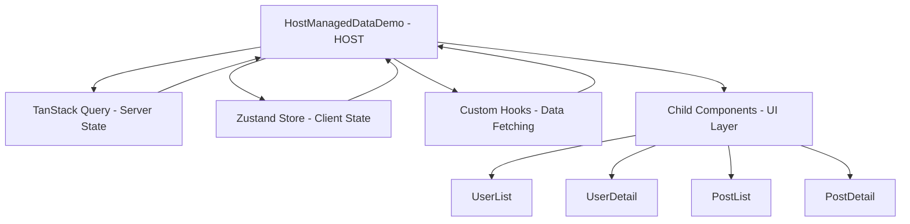

# Host-Managed Data Pattern Demo

[](./test-results.md)
[](https://www.typescriptlang.org/)
[](https://react.dev/)
[](https://storybook.js.org/)

This project demonstrates the **Host-Managed Data Pattern** using React, TypeScript, and modern development tools. It showcases clean separation of concerns between data management and UI rendering, with comprehensive dark mode support and full test coverage.

## ✨ Features

- 🏗️ **Host-Managed Data Pattern** - Clean separation between data and UI logic
- 🌓 **Dark Mode** - Complete light/dark theme with smooth transitions
- ⚡ **Real-time State Management** - TanStack Query + Zustand integration
- 🧪 **Comprehensive Testing** - 26 tests covering components, hooks, stores, and API
- 📚 **Storybook Integration** - Interactive component documentation and development
- 📱 **Responsive Design** - Mobile-first Tailwind CSS styling
- 🎨 **Component Library** - Reusable Card component with consistent styling
- 🔄 **Loading States** - Beautiful skeleton loading animations
- ❌ **Error Handling** - Graceful error states with user-friendly messages
- 🎯 **TypeScript** - Full type safety throughout the application

## 🚀 Quick Start

### Prerequisites
- Node.js 18+
- npm or yarn

### Installation & Setup

1. **Install dependencies:**
```bash
npm run install:all
```

2. **Start development servers:**
```bash
npm run dev
```

This will start:
- 🖥️ Frontend (React) on [http://localhost:3000](http://localhost:3000)
- 🔧 Backend (Node.js) on [http://localhost:3001](http://localhost:3001)
- 📚 Storybook on [http://localhost:6006](http://localhost:6006) (run separately)

3. **Run tests:**
```bash
npm test
```

4. **View component library:**
```bash
npm run storybook
```

5. **Build for production:**
```bash
npm run build
```

## 🏗️ Architecture

### Host-Managed Data Pattern

The Host-Managed Data Pattern creates a clear separation of concerns between **data management** and **UI rendering**:



## 🎯 How It Works

### **1. Host Component (`HostManagedDataDemo`)**
The central orchestrator that manages all data complexity:

```typescript
function DemoContent() {
  const { selectedUserId, selectedPostId } = useAppStore()

  // HOST MANAGES ALL DATA FETCHING
  const usersQuery = useUsers()                    // All users
  const selectedUserQuery = useUser(selectedUserId)  // Selected user details
  const postsQuery = usePosts(selectedUserId)        // Posts filtered by user
  const selectedPostQuery = usePost(selectedPostId)  // Selected post details

  return (
    <div>
      {/* CHILDREN RECEIVE DATA AS PROPS */}
      <UserList
        users={usersQuery.data || []}
        isLoading={usersQuery.isLoading}
        error={usersQuery.error}
      />
      <PostList
        posts={postsQuery.data || []}
        isLoading={postsQuery.isLoading}
        error={postsQuery.error}
      />
    </div>
  )
}
```

**Host Responsibilities:**
- **Centralized Data Orchestration**: Manages all data fetching through TanStack Query hooks
- **State Coordination**: Connects client state (Zustand) with server state (TanStack Query)
- **Data Distribution**: Passes data down to child components via props

### **2. State Management Layers**

#### **Server State** (TanStack Query)
- Handles API data fetching, caching, and synchronization
- Provides loading states, error handling, and automatic refetching
- Located in custom hooks (`useUsers`, `usePosts`, etc.)

#### **Client State** (Zustand Store)
- Manages UI selections (selected user/post IDs)
- Handles theme preferences and business logic
- Provides actions for state updates

```typescript
export const useAppStore = create<AppStore>((set) => ({
  selectedUserId: null,
  selectedPostId: null,
  
  setSelectedUserId: (userId) =>
    set((state) => ({
      selectedUserId: userId,
      // Clear post selection when user changes (business logic)
      selectedPostId: userId !== state.selectedUserId ? null : state.selectedPostId,
    })),
}))
```

### **3. Child Components (Pure UI Components)**

Child components are **props-driven** and focus purely on rendering:

```typescript
export function UserList({ users, isLoading, error }: UserListProps) {
  const { selectedUserId, setSelectedUserId } = useAppStore()
  
  // PURE UI LOGIC - no data fetching
  if (isLoading) return <LoadingSkeleton />
  if (error) return <ErrorDisplay error={error} />
  
  return (
    <div>
      {users.map(user => (
        <button onClick={() => setSelectedUserId(user.id)}>
          {user.name}
        </button>
      ))}
    </div>
  )
}
```

**Child Characteristics:**
- **No direct data fetching**: Receive all data through props from host
- **Event handlers**: Use store actions for user interactions
- **Focused responsibility**: Handle rendering and user interactions only

## 🔄 Data Flow Example

When a user clicks on a user in the UserList:

1. **UserList** calls `setSelectedUserId(userId)` from Zustand store
2. **Store update** triggers re-render of HostManagedDataDemo
3. **Host component** sees new `selectedUserId` and:
   - Fetches user details via `useUser(selectedUserId)`
   - Fetches user's posts via `usePosts(selectedUserId)`
   - Clears selected post (business logic in store)
4. **New data** flows down to UserDetail and PostList components
5. **UI updates** automatically with loading states, then data

## ✅ Pattern Benefits

### **Clear Separation of Concerns**
- **Host**: Manages data complexity and business logic
- **Children**: Handle UI rendering and user interactions

### **Predictable Data Flow**
- Data flows down through props
- Events bubble up through callbacks
- State changes are centralized in host

### **Enhanced Testability**
- Components can be tested in isolation
- Data dependencies are explicit
- Easy to mock data for Storybook stories

### **Improved Reusability**
- Child components are pure and reusable
- No tight coupling to specific data sources
- Easy to compose different layouts

### **Performance Optimization**
- TanStack Query provides intelligent caching
- Prevents unnecessary re-renders
- Efficient data synchronization across components

**Key Principles:**
- **Host Component** orchestrates all data fetching and state management
- **Child Components** receive data as props and handle only UI interactions
- **Client State** managed by Zustand for UI selections and theme preferences
- **Server State** managed by TanStack Query for API data with caching and synchronization

## 🛠️ Tech Stack

### Frontend
- ⚛️ **React 19** - Latest React with TypeScript
- ⚡ **Vite** - Fast build tooling and dev server
- 🎨 **Tailwind CSS** - Utility-first CSS with dark mode
- 🔄 **TanStack Query v5** - Server state management with caching
- 🐻 **Zustand** - Lightweight client state management
- 🧪 **Vitest** - Unit testing framework
- 📚 **React Testing Library** - Component testing utilities
- 📖 **Storybook** - Interactive component documentation and development

### Backend
- 🚀 **Node.js** with **Express** - RESTful API server
- 📘 **TypeScript** - Type-safe server development
- 🔄 **CORS** - Cross-origin resource sharing
- 🌱 **Mock Data** - Realistic demo data for development

### Development Tools
- 🔧 **TypeScript** - Static type checking
- 🎯 **ESLint** - Code linting and quality
- 🧹 **Prettier** integration via Tailwind
- 🔄 **Hot Reload** - Instant development feedback

## 📁 Project Structure

```
host-managed-data/
├── 📁 client/                    # React frontend application
│   ├── 📁 .storybook/            # Storybook configuration
│   │   ├── main.ts               # Storybook main config
│   │   └── preview.ts            # Global decorators and parameters
│   ├── 📁 public/
│   │   └── favicon.ico           # Custom favicon
│   ├── 📁 src/
│   │   ├── 📁 components/        # React components
│   │   │   ├── HostManagedDataDemo.tsx  # Main host component
│   │   │   ├── Card.tsx          # Reusable card wrapper
│   │   │   ├── UserList.tsx      # User listing component
│   │   │   ├── UserDetail.tsx    # User detail view
│   │   │   ├── PostList.tsx      # Post listing component
│   │   │   ├── PostDetail.tsx    # Post detail view
│   │   │   ├── *.stories.tsx     # Storybook stories
│   │   │   ├── __tests__/        # Component tests
│   │   │   └── index.ts          # Component exports
│   │   ├── 📁 hooks/             # Custom React hooks
│   │   │   ├── useUsers.ts       # User data hooks
│   │   │   ├── usePosts.ts       # Post data hooks
│   │   │   └── index.ts          # Hook exports
│   │   ├── 📁 stores/            # Zustand stores
│   │   │   ├── appStore.ts       # Main application state
│   │   │   └── __tests__/        # Store tests
│   │   ├── 📁 api/               # API client layer
│   │   │   └── client.ts         # HTTP client with type safety
│   │   ├── 📁 types/             # TypeScript definitions
│   │   │   ├── api.ts            # API response types
│   │   │   └── index.ts          # Type exports
│   │   ├── 📁 lib/               # Utility libraries
│   │   │   └── queryClient.ts    # TanStack Query configuration
│   │   ├── 📁 test/              # Test configuration
│   │   │   └── setup.ts          # Test environment setup
│   │   ├── App.tsx               # Root app component
│   │   ├── main.tsx              # Application entry point
│   │   └── index.css             # Global styles + Tailwind
│   ├── index.html                # HTML template
│   ├── package.json              # Frontend dependencies
│   ├── tailwind.config.js        # Tailwind configuration
│   ├── vite.config.ts            # Vite configuration
│   └── tsconfig.json             # TypeScript configuration
├── 📁 server/                    # Node.js backend
│   ├── 📁 src/
│   │   └── index.ts              # Express server with mock data
│   ├── package.json              # Backend dependencies
│   └── tsconfig.json             # Server TypeScript config
├── 📄 README.md                  # This documentation
├── 📄 test-results.md            # Test coverage report
├── 📄 .gitignore                 # Git ignore rules
└── 📄 package.json               # Root workspace configuration
```

## 🎯 Core Components

### Host Component (`HostManagedDataDemo`)
```typescript
// Orchestrates all data fetching and state management
const usersQuery = useUsers()
const selectedUserQuery = useUser(selectedUserId)
const postsQuery = usePosts(selectedUserId)
const selectedPostQuery = usePost(selectedPostId)
```

### Data Layer
- **TanStack Query**: Handles server state, caching, and synchronization
- **Zustand**: Manages client-side UI state (selections, theme, etc.)
- **API Client**: Centralized HTTP client for backend communication

### UI Components
- **UserList/UserDetail**: Display user data and handle selection
- **PostList/PostDetail**: Display post data with filtering by selected user
- **Card**: Reusable wrapper component with consistent styling

## 🌓 Dark Mode Implementation

Complete dark mode support with:
- **Class-based toggling** using Tailwind's `dark:` variants
- **Smooth transitions** on all interactive elements
- **Consistent color schemes** across all components
- **Enhanced shadows and borders** for both themes
- **Custom scrollbar styling** for both light and dark modes

## 📚 Storybook

Interactive component development and documentation:

```bash
npm run storybook              # Start Storybook dev server
npm run build-storybook        # Build static Storybook
```

### Features
- **Component Isolation**: Develop and test components in isolation
- **Dark Mode Toggle**: Switch between light and dark themes
- **Interactive Controls**: Modify component props in real-time
- **Auto-Generated Docs**: Automatic documentation from TypeScript types
- **Story Coverage**: Complete stories for all major components

### Available Stories
- **Card Component**: 4 variants (default, custom styling, with lists, minimal)
- **UserList Component**: 5 variants (default, loading, error, single user, empty)
- **PostList Component**: 6 variants (including long content scenarios)
- **PostDetail Component**: 7 variants (different content lengths and states)

## 🧪 Testing

### Test Coverage: 26 tests across 5 test files

- **Component Tests**: Rendering, user interactions, state changes
- **Store Tests**: State management logic, theme switching, data selection
- **Integration Tests**: API mocking, data flow validation
- **Error Handling**: Loading states, error boundaries

Run tests:
```bash
npm test                    # Run all tests
npm run test:client        # Frontend tests only
npm run test:server        # Backend tests only
```

## 📚 API Documentation

### Base URL
- Development: `http://localhost:3001/api`

### Endpoints

#### Users
```bash
GET /api/users              # Get all users
GET /api/users/:id          # Get specific user by ID
```

#### Posts
```bash
GET /api/posts              # Get all posts
GET /api/posts?userId=:id   # Get posts filtered by user ID
GET /api/posts/:id          # Get specific post by ID
```

#### Health Check
```bash
GET /health                 # Server health status
```

### Response Format
All API responses return JSON with appropriate HTTP status codes:
- `200` - Success
- `404` - Resource not found
- `500` - Server error

## 🔧 Development

### Available Scripts

```bash
# Development
npm run dev                 # Start both client and server
npm run dev:client         # Start frontend only
npm run dev:server         # Start backend only

# Storybook
npm run storybook          # Start Storybook dev server
npm run build-storybook    # Build static Storybook

# Building
npm run build              # Build both client and server
npm run build:client       # Build frontend only
npm run build:server       # Build backend only

# Testing
npm test                   # Run all tests
npm run test:client        # Run frontend tests
npm run test:server        # Run backend tests

# Dependencies
npm run install:all        # Install all dependencies
```

### Development Workflow

1. **Start development servers**: `npm run dev`
2. **Open Storybook** for component development: `npm run storybook`
3. **Make changes** to components, hooks, or stores
4. **Test components** in isolation using Storybook
5. **See live updates** via hot reload
6. **Run tests** to ensure functionality: `npm test`
7. **Build for production**: `npm run build`

## 🚀 Deployment

### Frontend (Client)
```bash
cd client
npm run build
# Deploy 'dist' folder to your hosting provider
```

### Backend (Server)
```bash
cd server
npm run build
npm start
# Deploy to your Node.js hosting provider
```

## 🎨 Customization

### Theme Customization
Modify `client/tailwind.config.js` to customize colors, spacing, and other design tokens.

### Adding Components
1. Create component in `client/src/components/`
2. Add to `client/src/components/index.ts`
3. Write tests in `client/src/components/__tests__/`

### API Extension
1. Add endpoints to `server/src/index.ts`
2. Update types in `client/src/types/api.ts`
3. Create hooks in `client/src/hooks/`

## 📖 Learning Resources

- [Host-Managed Data Pattern](https://react.dev/learn/sharing-state-between-components)
- [TanStack Query Documentation](https://tanstack.com/query/latest)
- [Zustand Documentation](https://zustand-demo.pmnd.rs/)
- [React Testing Library](https://testing-library.com/docs/react-testing-library/intro/)
- [Tailwind CSS](https://tailwindcss.com/docs)
- [Vite Documentation](https://vitejs.dev/)

## 🤝 Contributing

1. Fork the repository
2. Create a feature branch
3. Make your changes
4. Add tests for new functionality
5. Ensure all tests pass
6. Submit a pull request

## 📝 License

This project is for educational purposes and demonstrates modern React patterns and best practices.

---

**Built with ❤️ using the Host-Managed Data Pattern**