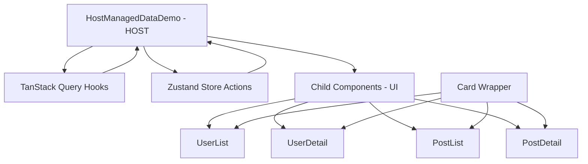

# Component Documentation

This document provides detailed documentation for all components in the Host-Managed Data Pattern Demo.

## 📚 Component Library

View all components interactively in Storybook:
```bash
npm run storybook
```

Browse to [http://localhost:6006](http://localhost:6006) to explore component variants, props, and documentation.

## 🏗️ Architecture Overview

The component architecture follows the Host-Managed Data Pattern with clear separation of concerns between **data management** and **UI rendering**:



## 🎯 Host-Managed Data Pattern Implementation

### **Data Flow Architecture**

The pattern creates a unidirectional data flow where:

1. **Host Component** (`HostManagedDataDemo`) acts as the single source of truth
2. **Data flows down** from host to children via props
3. **Events bubble up** from children to host via callbacks
4. **State updates** trigger new data fetching automatically

### **Layer Separation**

#### **Host Layer** (Data Management)
```typescript
// HostManagedDataDemo.tsx
function DemoContent() {
  const { selectedUserId, selectedPostId } = useAppStore()

  // Centralized data orchestration
  const usersQuery = useUsers()
  const selectedUserQuery = useUser(selectedUserId)
  const postsQuery = usePosts(selectedUserId)
  const selectedPostQuery = usePost(selectedPostId)

  // Props-based data distribution
  return (
    <UserList
      users={usersQuery.data || []}
      isLoading={usersQuery.isLoading}
      error={usersQuery.error}
    />
  )
}
```

#### **Child Layer** (UI Rendering)
```typescript
// UserList.tsx
export function UserList({ users, isLoading, error }: UserListProps) {
  const { setSelectedUserId } = useAppStore()
  
  // Pure UI logic - no data fetching
  return (
    <div>
      {users.map(user => (
        <button onClick={() => setSelectedUserId(user.id)}>
          {user.name}
        </button>
      ))}
    </div>
  )
}
```

### **State Management Strategy**

#### **Server State** (TanStack Query)
- **Caching**: Automatic data caching and invalidation
- **Synchronization**: Background refetching and updates
- **Error Handling**: Built-in error states and retry logic
- **Loading States**: Automatic loading indicators

#### **Client State** (Zustand)
- **UI Selections**: Track selected user/post IDs
- **Business Logic**: Smart state updates (e.g., clear post when user changes)
- **Theme Management**: Dark/light mode preferences
- **Local Actions**: Immediate UI state updates

### **Benefits in Practice**

#### **Component Isolation**
- Each child component can be developed and tested independently
- Storybook stories use demo components with local state
- Easy to mock data dependencies for testing

#### **Predictable Updates**
- All data changes flow through the host component
- State updates trigger automatic re-fetching
- UI stays synchronized with server state

#### **Performance Optimization**
- TanStack Query prevents unnecessary API calls
- Components only re-render when their props change
- Intelligent caching reduces network requests

## 🧩 Core Components

### HostManagedDataDemo
**Location:** `src/components/HostManagedDataDemo.tsx`

The main orchestrator component that manages all data fetching and state coordination.

**Responsibilities:**
- Manages TanStack Query for server state
- Coordinates Zustand store for client state
- Passes data down to child components
- Handles loading and error states

**Key Features:**
- Server state management with caching
- Client state management for UI selections
- Dark mode theme integration
- Responsive grid layout

**Storybook Stories:** Not applicable (host component with external dependencies)

### Card
**Location:** `src/components/Card.tsx`

A reusable wrapper component providing consistent styling and layout.

**Props:**
```typescript
interface CardProps {
  children: React.ReactNode
  className?: string
}
```

**Features:**
- Consistent padding and spacing
- Dark mode support
- Shadow and border styling
- Responsive design

**Storybook Stories:** [View in Storybook](http://localhost:6006/?path=/story/components-card--default)
- `Default` - Basic card with text content
- `WithChildren` - Card containing other components
- `LongContent` - Card with extended content
- `Minimal` - Card with minimal styling

### UserList
**Location:** `src/components/UserList.tsx`

Displays a list of users with selection capabilities.

**Props:**
```typescript
interface UserListProps {
  users: User[]
  selectedUserId: number | null
  onUserSelect: (userId: number) => void
  isLoading: boolean
  error: Error | null
}
```

**Features:**
- User selection highlighting
- Loading skeleton states
- Error handling
- Responsive user cards
- Dark mode support

**Demo Component:** `UserListDemo.tsx` for Storybook isolation

**Storybook Stories:** [View in Storybook](http://localhost:6006/?path=/story/components-userlist--default)
- `Default` - List with sample users
- `Loading` - Skeleton loading state
- `Error` - Error state display
- `SingleUser` - List with one user
- `Empty` - Empty state

### PostList
**Location:** `src/components/PostList.tsx`

Displays a list of posts with filtering and selection.

**Props:**
```typescript
interface PostListProps {
  posts: Post[]
  selectedPostId: number | null
  onPostSelect: (postId: number) => void
  selectedUserId: number | null
  isLoading: boolean
  error: Error | null
}
```

**Features:**
- Post filtering by selected user
- Post selection highlighting
- Loading skeleton states
- Error handling
- Content truncation
- Dark mode support

**Demo Component:** `PostListDemo.tsx` for Storybook isolation

**Storybook Stories:** [View in Storybook](http://localhost:6006/?path=/story/components-postlist--default)
- `Default` - List with sample posts
- `FilteredByUser` - Posts filtered by user
- `Loading` - Skeleton loading state
- `Error` - Error state display
- `Empty` - Empty state
- `LongContent` - Posts with long titles/content

### PostDetail
**Location:** `src/components/PostDetail.tsx`

Displays detailed view of a selected post.

**Props:**
```typescript
interface PostDetailProps {
  post: Post | undefined
  isLoading: boolean
  error: Error | null
}
```

**Features:**
- Full post content display
- Loading state
- Error handling
- No selection state
- Responsive typography
- Dark mode support

**Storybook Stories:** [View in Storybook](http://localhost:6006/?path=/story/components-postdetail--default)
- `Default` - Standard post display
- `LongContent` - Post with extensive content
- `Loading` - Loading state
- `Error` - Error state
- `NoSelection` - No post selected
- `ShortPost` - Minimal content post

## 🎨 Design System

### Color Scheme
- **Light Mode**: Gray-based palette with blue accents
- **Dark Mode**: Dark gray palette with blue accents
- **Interactive States**: Hover, focus, and selected states
- **Status Colors**: Error (red), success (green), warning (yellow)

### Typography
- **Headings**: Font weights 600-700
- **Body Text**: Font weight 400-500
- **Captions**: Smaller text with reduced opacity
- **Line Clamping**: Consistent truncation patterns

### Spacing
- **Consistent Scale**: 4px, 8px, 12px, 16px, 24px, 32px
- **Component Padding**: 12px-16px internal spacing
- **Grid Gaps**: 16px-24px between components
- **Responsive Spacing**: Adjusts on smaller screens

### Animations
- **Transitions**: 200ms ease-in-out for interactions
- **Loading Animations**: Pulse animation for skeletons
- **Hover Effects**: Subtle scale and shadow changes

## 🔧 Component Patterns

### Data Flow Pattern
1. **Host Component** fetches data using TanStack Query
2. **State Updates** managed through Zustand store
3. **Props Drilling** passes data to child components
4. **Event Callbacks** bubble up user interactions

### Loading States
All components implement consistent loading patterns:
- Skeleton animations for content areas
- Spinner indicators for actions
- Graceful degradation during loading

### Error Handling
Standardized error display:
- Error boundaries for crash protection
- User-friendly error messages
- Retry mechanisms where appropriate
- Fallback UI states

### Responsive Design
Mobile-first approach:
- Stacked layouts on mobile
- Grid layouts on desktop
- Touch-friendly interactive elements
- Scalable typography

## 📖 Storybook Integration

### Story Organization
```
Components/
├── Card/
│   ├── Default
│   ├── WithChildren
│   ├── LongContent
│   └── Minimal
├── UserList/
│   ├── Default
│   ├── Loading
│   ├── Error
│   ├── SingleUser
│   └── Empty
├── PostList/
│   ├── Default
│   ├── FilteredByUser
│   ├── Loading
│   ├── Error
│   ├── Empty
│   └── LongContent
└── PostDetail/
    ├── Default
    ├── LongContent
    ├── Loading
    ├── Error
    ├── NoSelection
    └── ShortPost
```

### Story Features
- **Interactive Controls**: Modify props in real-time
- **Auto-Generated Docs**: TypeScript-based documentation
- **Accessibility Testing**: Built-in a11y checks
- **Responsive Testing**: Viewport sizing tools
- **Dark Mode**: Theme switching capability

### Demo Components
For components with external dependencies (stores, queries), we use demo variants:
- `UserListDemo.tsx` - Isolated UserList with local state
- `PostListDemo.tsx` - Isolated PostList with local state

These demo components provide the same interface but manage state internally for Storybook.

## 🧪 Testing Strategy

### Component Testing
Each component includes comprehensive tests:
- Rendering with various props
- User interaction handling
- Error state behavior
- Accessibility compliance

### Visual Testing
Storybook provides visual regression testing:
- Snapshot testing for UI consistency
- Cross-browser compatibility
- Responsive design validation
- Dark mode verification

### Integration Testing
Host component tests validate:
- Data flow between components
- State management integration
- API interaction patterns
- Error propagation

## 🚀 Usage Examples

### Basic Component Usage
```typescript
import { UserList } from '@/components'

function MyApp() {
  return (
    <UserList
      users={users}
      selectedUserId={selectedId}
      onUserSelect={handleSelect}
      isLoading={loading}
      error={error}
    />
  )
}
```

### With Storybook
```typescript
// UserList.stories.ts
export const WithManyUsers: Story = {
  args: {
    users: generateMockUsers(20),
    selectedUserId: 1,
    isLoading: false,
    error: null,
  },
}
```

### Custom Styling
```typescript
<Card className="bg-blue-50 dark:bg-blue-900/20">
  <UserList {...props} />
</Card>
```

## 🔄 Contributing to Components

### Adding New Components
1. Create component file in `src/components/`
2. Export from `src/components/index.ts`
3. Write comprehensive tests
4. Create Storybook stories
5. Update this documentation

### Modifying Existing Components
1. Update component implementation
2. Update corresponding tests
3. Update Storybook stories
4. Verify all stories still work
5. Update documentation if needed

### Component Checklist
- [ ] TypeScript interfaces with JSDoc
- [ ] Dark mode support
- [ ] Responsive design
- [ ] Loading and error states
- [ ] Accessibility compliance
- [ ] Comprehensive tests
- [ ] Storybook stories
- [ ] Documentation updates

## 📚 Resources

- **React Patterns**: [React.dev](https://react.dev/learn)
- **TypeScript**: [TypeScript Handbook](https://www.typescriptlang.org/docs/)
- **Tailwind CSS**: [Tailwind Docs](https://tailwindcss.com/docs)
- **Storybook**: [Storybook Docs](https://storybook.js.org/docs)
- **Testing Library**: [Testing Library Docs](https://testing-library.com/docs/)
- **Accessibility**: [Web Content Accessibility Guidelines](https://www.w3.org/WAI/WCAG21/quickref/)